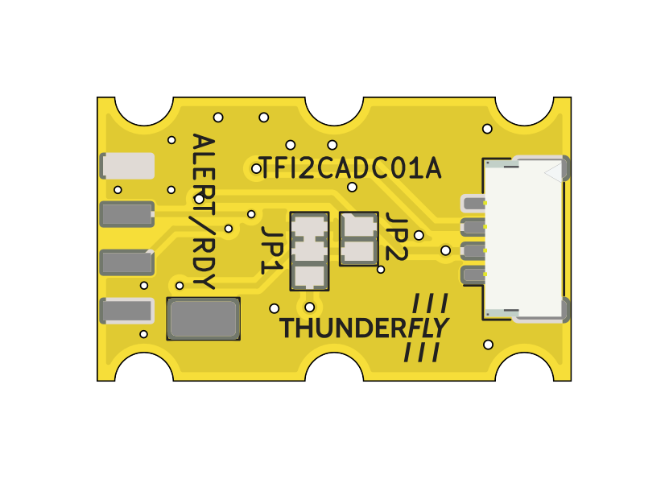

# TFI2CADC01A — I²C 16‑bit ADC module (Pixhawk compatible)

Compact 4‑channel analog‑to‑digital converter module for Pixhawk‑class autopilots and ThunderFly form‑factor carrier boards. Based on [TI ADS1115 (16‑bit Σ‑Δ ADC)](https://www.ti.com/lit/ds/symlink/ads1115.pdf?ts=1741234332539), powered from the I²C bus. Dual JST‑GH I²C ports support in‑line daisy‑chaining.





## Key features

* 4 × single‑ended inputs (**AIN0…AIN3**) up to VDD range (0–3.3 V)
* 16‑bit ADC (**ADS1115IDGS**) with programmable gain amplifier (PGA)
* I²C interface, 100/400 kHz compliant; on‑board 4.7 kΩ pull‑ups to 3.3 V
* **ADDR** solder-bridge for selectable I²C address (default **0x48**)
* **ALERT/RDY** interrupt output (optional test‑point)
* Bus‑powered from **+5 V**; on‑board LDO to internal 3.3 V
* Input/rail protection and status LEDs (PWR, activity)
* Two **JST‑GH 4‑pin** I²C ports for Pixhawk; one **2×4 header** for access to analog inputs and ground

## Electrical

* **Input supply (JST‑GH VBUS):** 5.4 V (Pixhawk I²C standard)
* **I²C levels:** 3.3 V (pull‑ups on board)
* **Analog input range:** 0…3.3 V (referenced to GND)
* **ESD / surge:** front‑end and bus clamped (5.6 V TVS on 5 V)

> ⚠️ Do **not** exceed 3.3 V on AINx relative to GND.

## Connectors & pinout

### JST‑GH I²C (J2, J3) — Pixhawk standard

```
Pin 1: VBUS +5V
Pin 2: SCL
Pin 3: SDA
Pin 4: GND
```

Both ports are wired in parallel for pass‑through/daisy‑chain.

### I²C addressing

The **ADDR** pin is placed on the PCB to select one of the ADS1115 base addresses. Default assembly is **0x48**.

| ADDR input  | 7‑bit I²C address |
| ----------- | ----------------- |
| GND         | 0x48 (default)    |
| VDD (3.3 V) | 0x49              |
| SDA         | 0x4A              |
| SCL         | 0x4B              |

> The board provides pads/jumper position for changing the ADDR strap. See silkscreen near **ADDR**.

## Jumpers / test points

* **T1 (ALERT/RDY):** routes the ADS1115 ALERT/RDY pin to a test pad for optional host interrupt. Leave open if unused.
* **JP2/JP2:** board address option tie (factory) to 3.3 V.

## LEDs

* **PWR (green):** 3.3 V power rail present.
* **ACT (orange):** activity/diagnostic (wired to logic as per schematic option).


## Typical wiring (Pixhawk)

1. Plug either JST‑GH port to a Pixhawk **I2C** port (5 V provided by autopilot).
2. Daisy‑chain additional I²C node from the second JST‑GH if needed.
3. Connect sensors to **AIN0…AIN3** via J1, or wire your signals to the corresponding pads.
4. (Optional) Strap **ADDR** for a non‑default address if multiple ADS1115 are present.

## Software notes (ADS1115)

* **PX4 support:** PX4 Autopilot includes a native driver for ADS1115 (16‑bit, up to 860 SPS, 4‑channel delta‑sigma ADC with PGA, oscillator, internal VREF, comparator and I²C). See [PX4 driver](https://github.com/PX4/PX4-Autopilot/tree/main/src/drivers/adc/ads1115) and [TI ADS1115](https://www.ti.com/product/ADS1115).
* **Use cases:** Pixhawk‑compatible ADC module is suitable for prototyping/attaching analog‑output sensors (e.g., temperature, humidity, gas presence, etc.).
* **Configuration tips:** configure PGA for expected full‑scale to maximize resolution; for single‑ended reads use MUX AIN0/1/2/3 vs GND; to minimize I²C polling enable comparator in "traditional" mode and read **ALERT/RDY** (if T1 is wired).

### Example (Linux `i2c-tools`)

```bash
# Detect
sudo i2cdetect -y 1

# Read a register (conversion register 0x00)
sudo i2cget -y 1 0x48 0x00 w
```

## Mechanical & form factor

PCB follows the **ThunderFly form factor** for avionics modules (mounting & stacking compatible with TF carriers). Two JST‑GH side‑by‑side for easy in‑line installation inside UAV wiring harnesses.

## Revision history

  - TFI2CADC01A - Initial revision

## Availability and Customization

The **TFI2CADC01A** is available from ThunderFly s.r.o. For a commercial quotation, contact us at [sale@thunderfly.cz](mailto:sale@thunderfly.cz) or shop via our Lectronz or Tindie store.

We also offer application‑specific modifications on request. Typical options include alternative input scaling (dividers/shunts), connector or cable variations, pre‑strapped I²C addresses, and simple mounting adaptations. Basic changes are usually provided at no additional cost with an estimated lead time of approximately three weeks.

